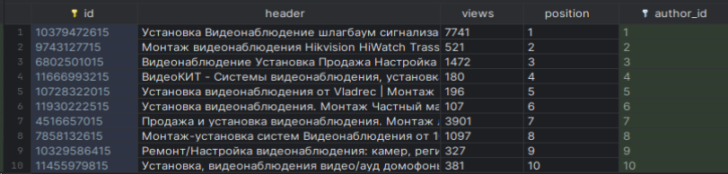
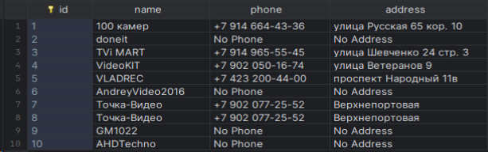
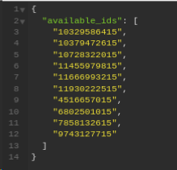
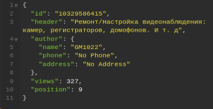

## Запуск приложения
1. Установите зависимости с помощью pip или poetry
2. Находясь в рабочей директории с manage.py выполните следующие команды:
```bash
python manage.py makemigrations
python manage.py migrate
python manage.py createsuperuser
python manage.py runserver
```
### Парсинг
1. Посетите главную страницу http://localhost:8000
2. Аутентифицируйтесь под суперпользоватeлем
3. В профиле будет доступна кнопка, позволяющая совершить парсинг из ТЗ.(Система защиты может нарушить процесс парсинга)

### Доступ к данным
1. Посетите главную страницу http://localhost:8000
2. Используя веб-интерфейс, пройдите процедуру регистрации.
3. После перенаправления, при успешной регистрации, скопируйте api-key.
4. Выполните запрос по адресу http://127.0.0.1:8000/api/v1/declaration с добавлением заголовка X-API-KEY со значением скопированным ранее.
5. Используя любой id из полученного json списка выполните запрос по адресу http://127.0.0.1:8000/api/v1/declaration?id=<id\> , сохраняя прежнее значение заголовка X-API-KEY.






